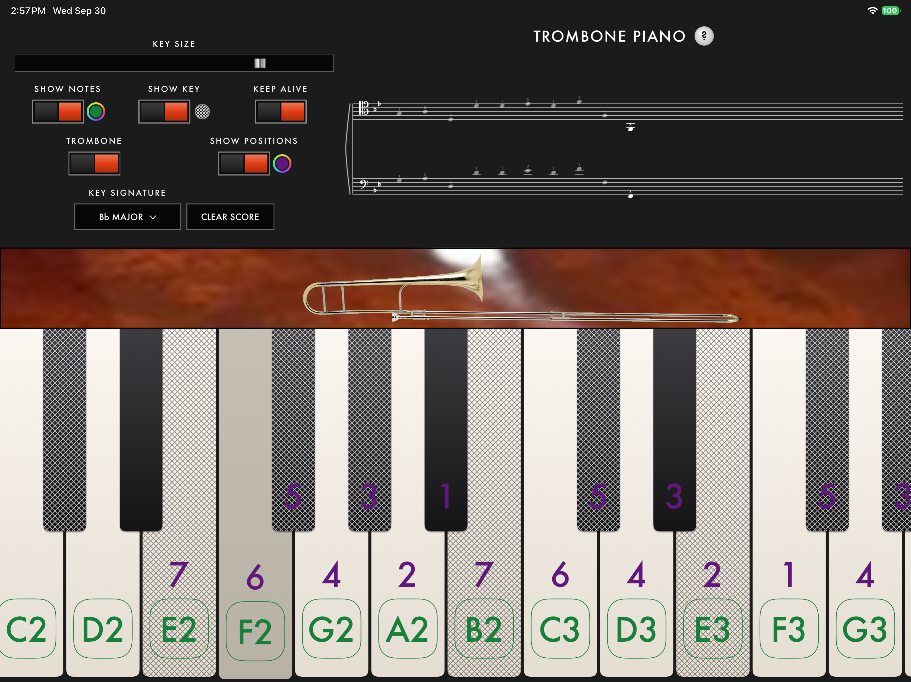

# Trombone Piano

I was just about to buy an MPK Mini Play to work out some tricky melodies on the trombone when I realized it would be more fun to build my own.

It's just a simple touch keyboard. Touch the keys to play, scroll to see the whole keyboard by sliding along the mahogany strip, and read the notes on a staff. Put in some helpers for trombone players who, like me, struggle with advanced topics like tenor clef and keys with sharps.

## What it does

**KEYBOARD.** Polyphonic. Slide the keyboard back and forth with the mahogany strip.

**KEY SIZE.** Sets how large the keys are.

**SHOW NOTES.** Prints the note name on each white key. The circle next to the switch sets the color.

**SHOW KEY.** Marks keys outside the key signature. The circle next to the switch sets the pattern.

**KEEP ALIVE.** Leaves the screen on while the app is open.

**TROMBONE.** On plays the trombone and shows the horn. Off plays the piano.

**SHOW POSITIONS.** Prints the slide position on keys a straight tenor trombone can play, and moves the slide on the trombone image. The circle next to the switch sets the color.

**MIDI.** On sends the keys to a computer and stays quiet on this device. Off plays here. The button beside the switch opens Bluetooth. See MIDI below.

**KEY SIGNATURE.** Sets the signature on the score and the SHOW KEY marks.

**SCORE.** Notes you play are written on the right. Trombone uses tenor and bass clef. Piano uses treble and bass. CLEAR SCORE empties it. With show positions on, the trombone score also prints the position above each note. Pinch the staff to grow or shrink it, and slide it to look around. RECENTER puts that view back.

## MIDI

With MIDI on, the keys send note on and note off on channel 1, and this device stays quiet. The source is named Trombone Piano. The staff, the horn, and the slide positions still follow the keys. The computer plays its own sound. Other apps on the iPad can use Trombone Piano as a MIDI input.

**Mac and GarageBand.** Plug the iPad into the Mac with a data cable and unlock it. Turn MIDI on in the app. The iPad stays quiet.

On the Mac, open Audio MIDI Setup from Applications → Utilities. Choose Window → Show MIDI Studio. The iPad is in that window. If it is gray, select it and click Enable. That is once per iPad. The iPad icon is the MIDI input. MIDI Studio does not add a port named Trombone Piano.

Open GarageBand and add a Software Instrument track. Any instrument works. Select the track, turn on its record button, and play a key. GarageBand plays the sound.

GarageBand → Settings → Audio/MIDI leaves MIDI Controller on None. That menu is for control-surface profiles. An iPad entry under Input Device is the iPad microphone. MIDI Status flashes when a note arrives. If it never flashes, quit GarageBand, click Rescan MIDI in MIDI Studio, and open GarageBand again with the app's MIDI switch already on.

Logic, Ableton, and MuseScore on the Mac use that same enabled iPad as their MIDI input. SweetPad can stay attached on the cable. After a rebuild, rescan MIDI if the notes stop.

**Windows, Wi-Fi.** Put the iPad and the PC on the same network. A guest network that isolates devices will not work. Install the free [rtpMIDI](https://www.tobias-erichsen.de/software/rtpmidi.html) driver, add a session, enable it, and connect to the iPad. If the iPad is not in the list, add it by its address, and allow that UDP port and the next one through the firewall. In MuseScore, select that session as the MIDI input, start note input, and play. The USB cable does not make the iPad a MIDI device on Windows.

**Bluetooth.** Turn MIDI on, tap the button beside the switch, and turn advertising on. On a Mac, pair from the Bluetooth control in MIDI Studio. On Windows 10 or later, pair it as a Bluetooth MIDI device, then choose Trombone Piano as the MIDI input.

## Code

UIKit, drawn in views rather than built from controls. The iPad target is `TrombonePiano`. Tests are `TrombonePianoTests`.

`PianoViewController` owns the screen and the saved settings. `MoogPanelView` is the control panel, `ScoreView` and `ScoreNotation` are the staff, and `PianoKeyboardView` with `PianoGeometry` is the keybed. `PianoAudio` plays the samples. `MidiOut` sends the notes when MIDI is on. `RosewoodView` draws the mahogany strip. The horn is three images so the outer slide can move on its own: `trombone_inner.png`, `trombone_outer.png`, and `trombone_over.png`.

Build and test from the editor with [Sweetpad](https://sweetpad.hyzyla.dev/). `buildServer.json` is its build server, and `.vscode/settings.json` points it at `TrombonePiano.xcodeproj`. The test target covers key geometry, the panel layout, the staff, the trombone loop, and the MIDI note messages.

## Sounds and art

Both instruments are Fluid (R3) SoundFont samples, one mp3 per key from A0 through C8. File names use flats (`piano-Bb4.mp3`, `trombone-Eb3.mp3`), which is how those samples are spelled. The copyright notice is `TrombonePiano/Sounds/NOTICE.txt`.

A piano note plays its file and stops. A trombone note plays the attack, then loops a slice of the steady tone. The loop is cut on a period of the waveform and crossfaded so the join does not click.

The pictures that ship in the app are the mahogany strip, the three horn layers, and the app icon. The GIMP files in `images/` (`mahogany.xcf`, `trombone.xcf`, `brass.xcf`, and the rest) are the working drawings and are not in the bundle. `images/screenshot.png` is the picture at the top of this file.
